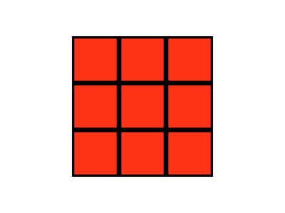

# Transformations (Part 2)

This lesson will show you how matrix multiplication can be used
to implement the scaling and translation transformations
introduced in the previous lesson.  We'll see also that it's
possible to represent the cumulative effect of a series of
transformations with just one 4x4 matrix.  Then we'll redo the
previous lesson's third example, using matrix multiplication in
the vertex shader code.

## Transformations Represented by Matrices

The previous lesson's examples illustrate two possible scaling
transformations:

-   Multiply the $x$ coordinate of every vertex by $\frac{3}{4}$
    (i.e., the reciprocal of the aspect ratio).

-   Multiply the $x$, $y$ and $z$ coordinates of every vertex by
    the same value (`scaleFactor`).

We can define a general 3D scaling transformation that would
include both:

-   Scale a vertex $(x, y, z)$ by factors $(s_x, s_y, s_z)$:
    $(x', y', z') = (s_x x, s_y y, s_z z)$

This could be written as three equations...

$$\begin{aligned}
x' &= s_x x \\  
y' &= s_y y \\  
z' &= s_z z
\end{aligned}
$$

...but it's typically written as one matrix multiplication:

$$\begin{bmatrix}
x' \\
y' \\
z'
\end{bmatrix}
=
\begin{bmatrix}
s_x & 0   & 0   \\
0   & s_y & 0   \\
0   & 0   & s_z
\end{bmatrix}
\begin{bmatrix}
x \\
y \\
z
\end{bmatrix}$$

What does this mean? Well, here's how multiplication would be
defined for a general 3x3 matrix times a 3x1 matrix representing a
vertex with $x$, $y$ and $z$ coordinates:

$$\begin{bmatrix}
x' \\
y' \\
z'
\end{bmatrix}
=
\begin{bmatrix}
m_{11} & m_{12} & m_{13} \\
m_{21} & m_{22} & m_{23} \\
m_{31} & m_{32} & m_{33}
\end{bmatrix}
\begin{bmatrix}
x \\
y \\
z
\end{bmatrix}
=
\begin{bmatrix}
m_{11} x + m_{12} y + m_{13} z \\
m_{21} x + m_{22} y + m_{23} z \\
m_{31} x + m_{32} y + m_{33} z
\end{bmatrix}$$

Notice that $m_{11}$ provides a way of making $x'$ depend on
$x$; it's the term you use if you want $x'$ to be equal to $x$
times a scaling factor:

$$\begin{aligned}
x' &= s_x x + 0 \times y + 0 \times z \\
x' &= s_x x
\end{aligned}$$

Similarly $m_{22}$ is the term you use
if you want $y'$ to depend on $y$, and $m_{33}$ is the term you
use if you want $z'$ to depend on $z$.

What if $m_{11}$, $m_{22}$
and $m_{33}$ are all $1$?  We have the *identity matrix*:

$$\begin{bmatrix}
1 & 0 & 0 \\
0 & 1 & 0 \\
0 & 0 & 1
\end{bmatrix}$$

This is the matrix which, if you multiply it times a vertex,
gives you back the same vertex you started with.  We'll come back
to this later.  What about the other terms---$m_{12}$, $m_{13}$,
etc.?  They give you ways of making, for example, $x'$ depend on
$y$ or $z$.  We don't need them for scaling, but we'll use them
later for rotation transformations.

So we can use a 3x3 matrix to represent a general 3D scaling
transformation.  What about translation?  In the examples above,
we added the same value to the $x$ coordinate of every vertex.
But there's no term in the 3x3 matrix we can use to do this.
We can make $x'$ depend on $x$, $y$ or $z$, but we can't just add
the same thing to every $x$, regardless of the $y$, $z$ or
original $x$ values.  A 3x3 matrix won't work.

But a 4x4 will:

$$\begin{bmatrix}
x' \\
y' \\
z' \\
1
\end{bmatrix}
=
\begin{bmatrix}
1 & 0 & 0 & t_x \\
0 & 1 & 0 & t_y \\
0 & 0 & 1 & t_z \\
0 & 0 & 0 & 1
\end{bmatrix}
\begin{bmatrix}
x \\
y \\
z \\
1
\end{bmatrix}$$

Recall example 2 from the WebGL lesson:  in the vertex shader we
had to put the vertex in *homogeneous coordinates* before
assigning its `position` to `gl_Position`.  We added a fourth
value of `1.0`, because of the way homogeneous coordinates are
defined: $(x, y, z, w)$, in homogeneous coordinates, is equivalent
to $(\frac{x}{w}, \frac{y}{w}, \frac{z}{w})$ in standard
coordinates.  So the extra $1$ at the end of each vertex in the
equation above doesn't change the vertex's position.

What it does, however, is give us a way to add the same
value---whatever we put in $t_x$---to the $x$ coordinate of every
vertex:

$$\begin{aligned}
x' &= 1 \times x + 0 \times y + 0 \times z + t_x \times 1 \\
x' &= x + t_x
\end{aligned}$$

We can likewise use $t_y$ to translate in the $y$ direction or
$t_z$ to translate in the $z$ direction.

Here's what the scaling transformation looks like if we use
homogeneous coordinates:

$$\begin{bmatrix}
x' \\
y' \\
z' \\
1
\end{bmatrix}
=
\begin{bmatrix}
s_x & 0   & 0   & 0 \\
0   & s_y & 0   & 0 \\
0   & 0   & s_z & 0 \\
0   & 0   & 0   & 1
\end{bmatrix}
\begin{bmatrix}
x \\
y \\
z \\
1
\end{bmatrix}$$

Notice that the terms we used for $t_x$, $t_y$ and $t_z$ are all
$0$.  This should make sense, because the scaling transformation
isn't supposed to add anything to $x$, $y$ and $z$; it's supposed
to multiply them by $s_x$, $s_y$ and $s_z$.  But what if we put
something in the translation terms?  Could we use the same matrix
to scale *and* translate?  Yes:

$$\begin{bmatrix}
x' \\
y' \\
z' \\
1
\end{bmatrix}
=
\begin{bmatrix}
s_x & 0   & 0   & t_x \\
0   & s_y & 0   & t_y \\
0   & 0   & s_z & t_z \\
0   & 0   & 0   & 1
\end{bmatrix}
\begin{bmatrix}
x \\
y \\
z \\
1
\end{bmatrix}$$

What exactly does this mean?  We can write it as three equations to
make it clearer:

$$\begin{aligned}
x' &= s_x x + t_x \\  
y' &= s_y y + t_y \\  
z' &= s_z z + t_z
\end{aligned}$$

This is starting to look like our vertex shader code from examples
3 and 4 in the previous lesson.  Which one, though?  They didn't
do the same thing.  It
turns out this is like example 3, where the translation amount was
in the original coordinate system rather than the scaled coordinate
system.  A transformation
like the one in example 4 would look like this:

$$\begin{aligned}
x' &= s_x x + s_x t_x \\
y' &= s_y y + s_y t_y \\
z' &= s_z z + s_z t_z
\end{aligned}$$

Or, as a matrix multiplication:

$$\begin{bmatrix}
x' \\
y' \\
z' \\
1
\end{bmatrix}
=
\begin{bmatrix}
s_x & 0   & 0   & s_x t_x \\
0   & s_y & 0   & s_y t_y \\
0   & 0   & s_z & s_z t_z \\
0   & 0   & 0   & 1
\end{bmatrix}
\begin{bmatrix}
x \\
y \\
z \\
1
\end{bmatrix}$$

What's going on here?  The first *composite transformation* matrix
represents scaling first, and then translating; the second
represents translating first, then scaling.  (Recall the vertex
shader code from examples 3 and 4.)  To show this, we need to
know how to multiply one square matrix times another, so we'll start
with that.

Here's how multiplication is defined for 2x2 matrices:

$$\begin{bmatrix}
a_{11} & a_{12} \\
a_{21} & a_{22}
\end{bmatrix}
\begin{bmatrix}
b_{11} & b_{12} \\
b_{21} & b_{22}
\end{bmatrix}
=
\begin{bmatrix}
(a_{11}b_{11} + a_{12}b_{21}) & (a_{11}b_{12} + a_{12}b_{22}) \\
(a_{21}b_{11} + a_{22}b_{21}) & (a_{21}b_{12} + a_{22}b_{22})
\end{bmatrix}$$

Notice that, for a term in the product matrix, row terms from
the first matrix are multiplied by column terms from the second.
In general, the product matrix term $p_{ij}$ is equal to the
sum produced by multiplying the row$_i$ terms from the first
matrix by the column$_j$ terms from the second, and then adding
the resulting values together.  This is true for any size
square matrices, including the 4x4 transformation matrices
we're interested in.  Let's work through an example
using the scaling matrix as the first matrix and the translation
matrix as the second:

$$\begin{bmatrix}
s_x & 0   & 0   & 0 \\
0   & s_y & 0   & 0 \\
0   & 0   & s_z & 0 \\
0   & 0   & 0   & 1
\end{bmatrix}
\begin{bmatrix}
1 & 0 & 0 & t_x \\
0 & 1 & 0 & t_y \\
0 & 0 & 1 & t_z \\
0 & 0 & 0 & 1
\end{bmatrix}$$

To get the first term of the product, we need to multiply the
terms from the first row of the scaling matrix by the terms from
the first column of the translation matrix, and then sum the
results together:

$$\begin{aligned}
p_{11} &= s_x \times 1 + 0 \times 0 + 0 \times 0 + 0 \times 0 \\
p_{11} &= s_x
\end{aligned}$$

$p_{11}$ is in the "how much to scale $x$" position.  This value
stays equal to $s_x$, which means the composite transformation
matrix will scale by the same amount as the scaling matrix, i.e.,
so far so good.  What about $p_{12}$?

$$\begin{aligned}
p_{12} &= s_x \times 0 + 0 \times 1 + 0 \times 0 + 0 \times 0 \\
p_{12} &= 0
\end{aligned}$$

Good.  We didn't want anything in the composite matrix to make
$x'$ depend on $y$.  What about the first translation term, in
the upper right corner of the composite matrix?

$$\begin{aligned}
p_{14} &= s_x t_x + 0 \times t_y + 0 \times t_z + 0 \times 1 \\
p_{14} &= s_x t_x
\end{aligned}$$

Aha!  The translation amount is multiplied by the scale factor.
Could it be that our composite matrix represents the
"translate first, then scale" transformation used in example 4?
Yes.  Here's what you get if you work through all the terms:

$$\begin{bmatrix}
s_x & 0   & 0   & s_x t_x \\
0   & s_y & 0   & s_y t_y \\
0   & 0   & s_z & s_z t_z \\
0   & 0   & 0   & 1
\end{bmatrix}$$

So, to get the "translate first, then scale" composite
transformation, you multiply the scaling matrix times the
translation matrix, as shown above.  What if you were to multiply
the translation matrix times the scaling matrix, as shown here?

$$\begin{bmatrix}
1 & 0 & 0 & t_x \\
0 & 1 & 0 & t_y \\
0 & 0 & 1 & t_z \\
0 & 0 & 0 & 1
\end{bmatrix}
\begin{bmatrix}
s_x & 0   & 0   & 0 \\
0   & s_y & 0   & 0 \\
0   & 0   & s_z & 0 \\
0   & 0   & 0   & 1
\end{bmatrix}$$

What will we get for the product's first scaling term, $p_{11}$?
What about the first translation term, $p_{14}$?

$$\begin{aligned}
p_{11} &= 1 \times s_x + 0 \times 0 + 0 \times 0 + 0 \times 0 \\
p_{11} &= s_x
\end{aligned}$$

$$\begin{aligned}
p_{14} &= 1 \times 0 + 0 \times 0 + 0 \times 0 + t_x \times 1 \\
p_{14} &= t_x
\end{aligned}$$

This is just what we'd expect, if the product represents the
"scale first, then translate" transformation used in example 3.
And it turns out that it does:

$$\begin{bmatrix}
s_x & 0   & 0   & t_x \\
0   & s_y & 0   & t_y \\
0   & 0   & s_z & t_z \\
0   & 0   & 0   & 1
\end{bmatrix}$$

These examples show that we can create matrices representing
composite transformations by multiplying matrices representing
simpler transformations (scale, or translate) together.  They
also show that matrix multiplication is *not* commutative; that
is, for matrices $A$ and $B$ (with dimensions such that
multiplication is possible), $AB \ne BA$.

Exercise #: *The third and fourth examples in the previous lesson,
"Squares in Different Places" and "Squares in Different Different
Places,"
show visually that the order of
transformations is significant, but you can work it out by
hand to see the difference more clearly.*

-   *Pick one of the vertices of the square.  Find the
    $x$, $y$ and $z$ values for that vertex defined in the
    JavaScript part of the program.*
-   *Work through (on paper and / or with a calculator) the
    transformations
    applied to that vertex in the vertex shader from the third
    example (Squares in Different Places), first for the orange
    square and then for the blue.*
-   *Then work through the transformations applied to that
    vertex in the vertex shader from the fourth example (Squares in
    Different Different Places).*

*You should see that the $x$ values for the vertex you chose
are indeed different depending on which version of the vertex
shader is used.*

Exercise #: *Show that the following is true...*

$$\begin{bmatrix}
s_x & 0   & 0   & 0 \\
0   & s_y & 0   & 0 \\
0   & 0   & s_z & 0 \\
0   & 0   & 0   & 1
\end{bmatrix}
\begin{bmatrix}
1 & 0 & 0 & t_x \\
0 & 1 & 0 & t_y \\
0 & 0 & 1 & t_z \\
0 & 0 & 0 & 1
\end{bmatrix}
=
\begin{bmatrix}
s_x & 0   & 0   & s_x t_x \\
0   & s_y & 0   & s_y t_y \\
0   & 0   & s_z & s_z t_z \\
0   & 0   & 0   & 1
\end{bmatrix}$$

*...by working through each term in the product matrix.  (Terms
$p_{11}$, $p_{12}$ and $p_{14}$ were done for you in the
explanation above.)*

*Each term of the product matrix can be described in terms of its
effect on a vertex.  For example, the upper left term, $p_{11}$,
is in the "how much to scale x" position.  See how many of the
terms you can describe in this way, based on what you've learned
so far.  (You should be able to describe at least six.)*

Exercise #: *Repeat exercise 5.1, but use matrices to represent the
transformations...*

-   *Again, pick a vertex (but not the same one you picked for
    exercise 1).  Find its $x$, $y$ and $z$ values in the
    JavaScript part of the program.*
-   *Write the transformations you see in the vertex shader code
    for the third example (Squares in Different Places) as 4x4 matrices.*
-   *Work through the matrix multiplications
    required to get from the original vertex's $x$, $y$ and $z$
    to the values eventually assigned to `gl_Position` in the
    vertex shader.  Do this for the orange square's `scaleFactor`
    and `xTranslation` values, and then for the blue square's
    `scaleFactor` and `xTranslation` values.*
-   *Repeat the process for the vertex shader code for the fourth
    example (Squares in Different Different Places).*

*Again, you should see that the $x$ values for the vertex you
chose are indeed different depending on which version of the
vertex shader you used.*

## Squares in Different Places...with Matrices

In the previous section, vertices were represented by matrices
with a single column, and *post-multiplication* was used to
apply a transformation represented by a matrix.  Alternatively,
you can use *pre-multiplication* if vertices are represented
by matrices with a single row:

$$\begin{bmatrix}
x' & y' & z' & 1
\end{bmatrix}
=
\begin{bmatrix}
x & y & z & 1
\end{bmatrix}
\begin{bmatrix}
1   & 0   & 0   & 0 \\
0   & 1   & 0   & 0 \\
0   & 0   & 1   & 0 \\
t_x & t_y & t_z & 1
\end{bmatrix}$$

For pre-multiplication, what's shown here, the vertex comes first,
in contrast to examples of post-multiplcation in the previous
section, where the transformation matrix came first.  Also notice
that the transformation matrix has been *transposed*---what used to
be rows have become columns.  It turns out that we have a choice: we
can either post-multiply, as we did in the previous section, or we
can transpose transformation matrices and then pre-multiply.  Why
would we ever choose the second option?  It has to do with the
way arrays representing matrices are interpreted in the vertex
shader...

Given an array representing a matrix, there are two ways to
interpret it:  *row-major order* and *column-major order*.  Here's a
matrix:

$$\begin{bmatrix}
1 & 0 & 0 & t_x \\
0 & 1 & 0 & t_y \\
0 & 0 & 1 & t_z \\
0 & 0 & 0 & 1
\end{bmatrix}$$

Here's how you would code it as an array, if the language used
row-major order:

~~~javascript
tMatrix = [ 1, 0, 0, tx,
            0, 1, 0, ty,
            0, 0, 1, tz,
            0, 0, 0, 1 ];
~~~

And here's how you would have to code it if the language used
column-major order:

~~~javascript
tMatrix = [ 1,  0,  0,  0,
            0,  1,  0,  0,
            0,  0,  1,  0,
            tx, ty, tz, 1 ];
~~~

It looks as if you've transposed the matrix.  But technically
it's not transposed; a column-major language would interpret the
in a way that would make it represent the original translation
matrix above.  If you put the row-major version in a column-major
language, it would be interpreted as the transpose of the original.
(Similarly, if you put the column-major version in a program written
in a language using
row-major interpretation, it would be interpreted as the
transpose of the original.)  So it's not just what the code looks
like that determines whether it's the transpose, it also depends
on how the code is interpreted.

The OpenGL Shading Language (GLSL) interprets arrays representing
matrices as if they have been written in column-major order.  So
we can either write the code for our matrices in the normal way,
and then pre-multiply, since the array in our code will be
interpreted to represent the transpose of the transformation
matrix, or we can write the code so that it looks like the
transpose and post-multiply.  For this example we'll use the
first option.  The transformation matrices in our JavaScript
code will look normal, but we'll pre-multiply in the vertex
shader because we know our matrices will be interpreted as
having been transposed.

Here's the vertex shader, square.vert:

~~~glsl
attribute vec3 position;
uniform mat4 transform;

void main(void) {
    gl_Position = vec4(position, 1.0) * transform;
}
~~~

The `uniform` variable `transform` is a 4x4 transformation matrix
given in row-major order.  As explained above, it will be
interpreted as the column-major transpose of the transformation
matrix we're interested in, so when calculating `gl_Position`
we pre-multiply; that is, we put the vertex first.  Note that
the multiplication operation we need---multiply a 4-value vector
and a 4x4 matrix---is built in to GLSL.  Also, the vector is
automatically treated as a single row or as a single column
depending on which is needed to make the multiplication valid.

Suppose the functions listed below have been added to the
JavaScript file, square.js.  (Source code isn't included, since the
implementation of these functions is one of the exercises at the
end of this lesson.)

~~~javascript
// Returns an array representing a 4x4 identity matrix.
identityMatrix = function () {
    return [ 1, 0, 0, 0,
             0, 1, 0, 0,
             0, 0, 1, 0,
             0, 0, 0, 1 ];
};

// a - A 4x4 transformation matrix.
// b - A 4x4 transformation matrix.
// Returns the product matrix a * b.
multiply = function (a, b) {
    // Exercise 4...
};

// m - A 4x4 transformation matrix.
// sx, sy, sz - x, y and z scale factors.
// Returns the composite transformation produced by starting
// with m and then scaling by sx, sy and sz.
scale = function (m, sx, sy, sz) {
    // Exercise 4...
};

// m - A 4x4 transformation matrix.
// tx, ty, tz - x, y and z translation amounts.
// Returns the composite transformation produced by starting
// with m and then translating by tx, ty and tz.
translate = function (m, tx, ty, tz) {
    // Exercise 4...
};
~~~

Here's the code in `main` that would use these functions.  (As with
previous examples, this code would go after the code that sets up
the connection between the vertex data and the vertex shader
`attribute` variable `position`.)

~~~javascript
// Get references to shaders' uniform variables.
transformUniform = gl.getUniformLocation(shaderProgram,
        "transform");
colorUniform = gl.getUniformLocation(shaderProgram, "color");

// Set up for drawing from vertex buffer.
gl.vertexAttribPointer(vertexPositionAttribute, 3, gl.FLOAT,
        false, 12, 0);

// Clear the canvas.
gl.clearColor(0.0, 0.0, 0.0, 1.0);
gl.clear(gl.COLOR_BUFFER_BIT);

// Start with an identity matrix (transformation that doesn't
// change a vertex coordinates at all).
transform = identityMatrix();

// Scale x values to fix aspect ratio.
transform = scale(transform, 0.75, 1.0, 1.0);

// Translate x values to move square left.
orangeSquareTransform = translate(transform, -0.5, 0.0, 0.0);

// Scale to make the square bigger.
orangeSquareTransform = scale(orangeSquareTransform,
        1.25, 1.25, 1.25);

// Copy orangeSquareTransform to vertex shader uniform
// variable "transform"; draw orange square.
gl.uniformMatrix4fv(transformUniform, false,
        new Float32Array(orangeSquareTransform));
gl.uniform3f(colorUniform, 1.0, 0.6, 0.1);
gl.drawArrays(gl.TRIANGLE_STRIP, 0, 4);

// Copy transform (transformation matrix with only the scale
// to fix the aspect ratio) to vertex shader uniform variable
// "transform"; draw yellow square.
gl.uniformMatrix4fv(transformUniform, false,
        new Float32Array(transform));
gl.uniform3f(colorUniform, 1.0, 0.9, 0.1);
gl.drawArrays(gl.TRIANGLE_STRIP, 0, 4);

// Translate to move square right, make it smaller, copy
// transformation matrix to vertex shader, draw blue square.
blueSquareTransform = translate(transform, 0.5, 0.0, 0.0);
blueSquareTransform = scale(blueSquareTransform,
        0.75, 0.75, 0.75);
gl.uniformMatrix4fv(transformUniform, false,
        new Float32Array(blueSquareTransform));
gl.uniform3f(colorUniform, 0.1, 0.3, 0.8);
gl.drawArrays(gl.TRIANGLE_STRIP, 0, 4);
~~~

As you might guess from the title of this section, the image
generated by this code would match what was generated by
the previous lesson's "Squares in Different Places" example.

Exercise #: *Implement the `multiply`, `scale`,
and `translate` functions listed above so that
you have a working program for the example above.*

*To help you test your functions, here's a function that
prints a 16-element JavaScript array in the browser console.*

~~~javascript
// m - A 4x4 transformation matrix.
// d - Number of digits after the decimal point that should
//     be used when printing values from the matrix.
// Prints matrix to browser console.  (For testing.)
printMatrix = function (m, d) {
    var i;

    for (i = 0; i < 4; i++) {
        console.log(m[i * 4].toFixed(d) + ", " +
                m[i * 4 + 1].toFixed(d) + ", " +
                m[i * 4 + 2].toFixed(d) + ", " +
                m[i * 4 + 3].toFixed(d));
    }
};
~~~

Exercise #: *Rewrite the code from the previous exercise so that...*

-   *In the JavaScript part of the program, transformation
    matrix arrays look like they've been transposed.*
-   *The vertex shader uses post-multiplication rather than
    pre-multiplication when multiplying a transformation
    matrix and a vertex.*

*The image produced by your program should match what's
produced by your solution to the previous exercise.*

Exercise #: *Based on what you've learned so far, write
a WebGL program that generates an image like the side view of
a Rubik's Cube.*

-   *Your program should define vertex data for the four
    corners of just one square, like the examples above.*
-   *It should redraw that same square, in different colors,
    sizes and positions, to generate the image.*
-   *You will probably want to use the transformation matrix
    functions you wrote for exercise 4, but this is not
    required.*

*Figure 5.1 shows a possible solution.*

<figure markdown="1">
<!-- <canvas id="canvas_5_1" width="400" height="300"></canvas> -->

<figcaption>Figure #: Rubik's Cube Side View</figcaption>
</figure>
<!--  -->
