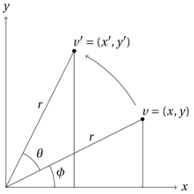
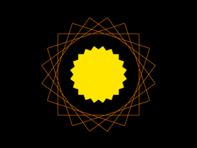
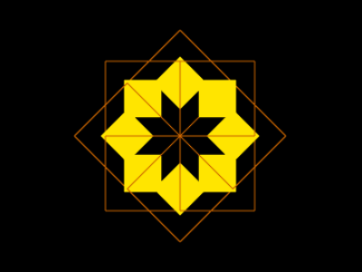
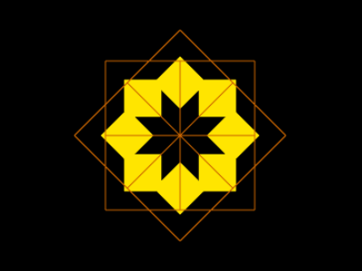
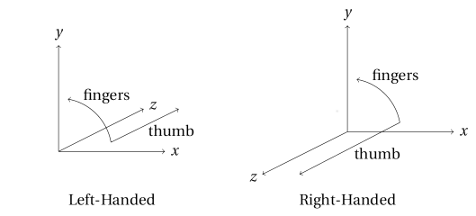
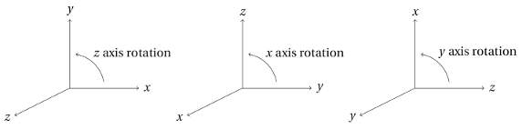
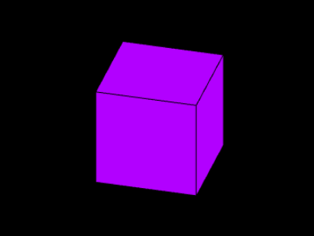

# Transformations (Part 3)

The first lesson on transformations introduced scaling and
translation transformations; the second lesson showed how
transformations can be represented using $4 \times 4$ matrices,
and also
introduced the idea of a composite transformation, formed by
multiplying the matrices representing two or more transformations
together.  Here we'll add rotation transformations, for rotating
about the $x$, $y$ and $z$ axes.  In the next lesson we'll add
a transformation that distorts the scene in a way that simulates
a 3D perspective effect.

<figure markdown="1" class="no-border">

<figcaption>Figure #: Rotation About the $z$ Axis</figcaption>
</figure>

<!-- image font doesn't quite match mathjax font :( -->

<!--
\begin{tikzpicture}[scale=0.5]

  \draw[->] (0,0) -- (0,10) node[above] {$y$};
  \draw[->] (0,0) -- (10,0) node[right] {$x$};

  \draw (0,0) -- (4,8) -- (4,0);
  \draw[fill] (4,8) circle (0.1);
  \draw (2,4.4) node[above] {$r$};
  \draw (5.6,8.5) node {$v' = (x', y')$};

  \draw (0,0) -- (8,4) -- (8,0);
  \draw[fill] (8,4) circle (0.1);
  \draw (5,2.5) node[above] {$r$};
  \draw (9.35,4.4) node {$v = (x, y)$};

  \draw (2,2) node {$\theta$};
  \draw (2,1) arc (25:65:2.05);

  \draw (3.2,0.85) node {$\phi$};
  \draw (2.85,0) arc (0:25:3);

  \draw[->] (7.6,4.8) arc (30:60:8);

\end{tikzpicture}
-->

### Rotations

First, rotation about the $z$ axis.  Figure 6.1 shows a diagram
representing a $z$ axis rotation from vertex $v$ to vertex $v'$.
We can represent the coordinates of $v$ in terms of $r$ and
$\phi$...

$$\begin{aligned}
x &= r \cos \phi \\
y &= r \sin \phi
\end{aligned}$$

...and the coordinates of $v'$ in terms of $r$, $\theta$ and
$\phi$:

$$\begin{aligned}
x' &= r \cos (\phi + \theta) \\
y' &= r \sin (\phi + \theta)
\end{aligned}$$

We can then use the following identities...

$$\begin{aligned}
\cos (\phi + \theta) &= \cos \phi \cos \theta - \sin \phi \sin \theta \\
\sin (\phi + \theta) &= \cos \phi \sin \theta + \sin \phi \cos \theta
\end{aligned}$$

...to rewrite the coordinates of $v'$:

$$\begin{aligned}
x' = r \cos (\phi + \theta) = r \cos \phi \cos \theta -
    r \sin \phi \sin \theta \\
y' = r \sin (\phi + \theta) = r \cos \phi \sin \theta +
    r \sin \phi \cos \theta
\end{aligned}$$

Substituting $x$ for $r \cos \phi$ and $y$ for $r \sin \phi$, we
can get rid of $r$ and $\phi$, so that we have the coordinates of
the rotated point $v'$ in terms of only the coordinates of the
original point $v$ and the angle of rotation $\theta$:

$$\begin{aligned}
x' = x \cos \theta - y \sin \theta \\
y' = x \sin \theta + y \cos \theta
\end{aligned}$$

This is our $z$ axis rotation transformation.  It can be rewritten
as a matrix multiplication, with the vertices given in
homogeneous coordinates:

$$\begin{bmatrix}
x' \\
y' \\
z' \\
1
\end{bmatrix}
=
\begin{bmatrix}
x \cos \theta - y \sin \theta \\
x \sin \theta + y \cos \theta \\
z \\
1
\end{bmatrix}
=
\begin{bmatrix}
\cos \theta & - \sin \theta & 0 & 0 \\
\sin \theta &   \cos \theta & 0 & 0 \\
0 & 0 & 1 & 0 \\
0 & 0 & 0 & 1
\end{bmatrix}
\begin{bmatrix}
x \\
y \\
z \\
1
\end{bmatrix}$$

Notice that this transformation makes use of two terms that were
zero for the scale and translation transformations, what we might
call the "add scaled $y$ to $x$" term (which is set to
$- \sin \theta$) and the "add scaled $x$ to $y$" term
($\sin \theta$).

### A Yellow Star

Let's add a $z$ axis rotation function to the scaling and
translation functions you wrote for the previous lesson.  Add
this to the `Transform` constructor as a public method.  (Notice
the `pb` in front of `rotateZ`.)

~~~javascript
// a - Rotation angle in degrees.
//
// Start with current transformation, add a counter-clockwise
// rotation about the z axis.
pb.rotateZ = function (a) {
    var r, s, c;

    r = Math.PI * a / 180.0;
    s = Math.sin(r);
    c = Math.cos(r);

    pv.multiplyBy([ c,   -s,   0.0, 0.0,
                    s,    c,   0.0, 0.0,
                    0.0,  0.0, 1.0, 0.0,
                    0.0,  0.0, 0.0, 1.0 ]);
};
~~~

In the same file, we'll update `drawFromBuffer` so that it knows
about the `LINE_LOOP` mode:

~~~javascript
if (modeString === "LINE_LOOP") {
    mode = pv.gl.LINE_LOOP;
} else if (modeString === "TRIANGLE_FAN") {
    mode = pv.gl.TRIANGLE_FAN;
}
~~~

Now we can draw filled or empty squares.  Figure 6.2 shows the image
generated by the code below.  (The order of the
vertices is different from examples in previous lessons, which
used `TRIANGLE_STRIP` mode when drawing the square.)

~~~javascript
/*jslint white: true */
/*global Canvas, Transform */

(function (global) {
    "use strict";
    var BLACK  = [0.0, 0.0, 0.0],
        YELLOW = [1.0, 0.9, 0.0],
        ORANGE = [0.8, 0.4, 0.0],
        cv, main;

    global.onload = function () {
        cv = new Canvas("canvas", BLACK);
        cv.setupShaders("star.vert", "star.frag",
                "transform", "position", "color", main);
    };

    main = function () {
        var tf, buffer, a;

        tf = new Transform();
        tf.scale(0.75, 1, 1);

        buffer = cv.copyVertexDataToBuffer([
                -0.5,  0.5,  0.0,
                -0.5, -0.5,  0.0,
                 0.5, -0.5,  0.0,
                 0.5,  0.5,  0.0 ]);

        cv.clear();

        for (a = 0; a < 360; a += 36) {
            tf.rotateZ(36);

            tf.scale(0.5, 0.5, 0.5);  // Half size.
            cv.setTransform(tf);
            cv.setColor(YELLOW);
            cv.drawFromBuffer(buffer, 0, 4, "TRIANGLE_FAN");
            tf.scale(2.0, 2.0, 2.0);  // Back to normal size.

            cv.setTransform(tf);
            cv.setColor(ORANGE);
            cv.drawFromBuffer(buffer, 0, 4, "LINE_LOOP");
        }
    };
}(this));
~~~

<figure markdown="1">

<figcaption>Figure #: A Yellow Star</figcaption>
</figure>

### A Different Yellow Star

In the previous example, the coordinate system was rotated about
the $z$ axis,
$x = y = 0$.  What if we wanted to rotate around a different axis,
say, $x = y = \frac{1}{2}$?  We can do it by creating a composite
transformation:

-   Translate so that $(0.5, 0.5)$ is moved to where the origin
    was.  (That is, translate by $-0.5$ in the $x$ and $y$ directions.)
-   Then rotate around the $z$ axis, which goes through the new
    origin.
-   Then translate back, so that the origin is where it was
    originally.
    
The code below shows these three transformations, used to rotate
around the axis $x = y = \frac{1}{2}$ (with a rotation angle
different from that of the previous example, to make a different
kind of star shape).

~~~javascript
for (a = 0; a < 360; a += 45) {

    // Rotate around the axis x = y = 0.5.  This is
    // accomplished by 1) translating so that the desired
    // axis of rotation is now the z axis, 2) rotating, and
    // 3) translating back, so that it's as if the whole
    // coordinate system had only been rotated.
    tf.translate(-0.5, -0.5, 0.0);
    tf.rotateZ(45);
    tf.translate(0.5, 0.5, 0.0);

    tf.scale(0.5, 0.5, 0.5);
    cv.setTransform(tf);
    cv.setColor(YELLOW);
    cv.drawFromBuffer(buffer, 0, 4, "TRIANGLE_FAN");
    tf.scale(2.0, 2.0, 2.0);

    cv.setTransform(tf);
    cv.setColor(ORANGE);
    cv.drawFromBuffer(buffer, 0, 4, "LINE_LOOP");
}
~~~

The image produced by this code is larger, and is not centered
at the origin.  To get what you see in figure 6.3, you also need
to change the transformation you start with, before you get to
the loop:

~~~javascript
tf = transform();
tf.scale(0.375, 0.5, 0.5);   // Fix aspect ratio, but also make
                             // everything smaller.
tf.translate(0.5, 0.5, 0.0); // Move origin so that image will
                             // be centered.
~~~

<figure markdown="1">

<figcaption>Figure #: A Different Yellow Star</figcaption>
</figure>

### A (Slightly) Different Different Yellow Star

If you look closely at figure 6.3, you'll see that it seems to
have a small mistake.  The "northeast" yellow square does not
have an orange line through it.  This is because of the order
the filled and unfilled squares were drawn.  Remember,
whatever is drawn sooner will be covered by what is drawn
later.  The unfilled orange square whose line would have gone
through that yellow square must have been drawn before the
square was.

How can we fix this?  There are two ways.  First, you could
make it so that all of the filled yellow squares are drawn
before all of the unfilled orange ones---you could use two
separate loops.  But there's another way to fix this problem,
one that will introduce a new and very important feature of
WebGL:  the *depth test*.

Recall that, when you clear the canvas, you pass the argument
`gl.COLOR_BUFFER_BIT` to `gl.clear`.  That is, you clear the
color buffer.  This is a buffer that stores the color of
every pixel in the canvas.  Another buffer, the *depth buffer*
is used to store a value representing the depth of each pixel
in the canvas.  But wait, what is the *depth* of a pixel?
That doesn't really make sense.  The depth stored for each
pixel is actually a number representing the distance from
the viewer *for the fragment* most recently drawn at that
pixel.  When you turn on the depth test, you are telling
WebGL to check, each time a fragment is about to be drawn,
that it's in front of whatever was drawn before at that pixel.
If it's in front, it's drawn.  If not it's discarded.

To turn on the depth test, add the following statement to
the library JavaScript file, just after getting the `canvas`
element's WebGL context and assigning it to `gl`:

~~~javascript
pv.gl = document.getElementById(id).getContext(
        "experimental-webgl");
pv.gl.enable(pv.gl.DEPTH_TEST);
~~~

Also, when you clear the canvas, you need to clear the depth
buffer in addition to the color buffer.  To clear the depth
buffer means to set the depth value associated with every
pixel to the far plane forming the back of the canonical
view volume.  This means that the first fragment drawn at
any pixel position will always pass the depth test.  Here's
a new version of `clear` that clears the depth buffer.
(Together with this change you'll
also want to add `bitwise: true` to the `/*jslint` comment line
at the beginning, since JSLint assumes by default that `|` should
be `||`.)

~~~javascript
pb.clear = function () {
    pv.gl.clear(
            pv.gl.COLOR_BUFFER_BIT | pv.gl.DEPTH_BUFFER_BIT);
};
~~~

And here's a new version of the loop from the previous
example, modified to put all the unfilled orange squares in
the front (without using two separate loops).  Figure 6.4 shows
the image produced by this version of the program.

~~~javascript
for (a = 0; a < 360; a += 45) {
    tf.translate(-0.5, -0.5, 0.0);
    tf.rotateZ(45);
    tf.translate(0.5, 0.5, 0.0);

    tf.translate(0.0, 0.0, 0.1);   // Move back.

    tf.scale(0.5, 0.5, 0.5);
    cv.setTransform(tf);
    cv.setColor(YELLOW);
    cv.drawFromBuffer(buffer, 0, 4, "TRIANGLE_FAN");
    tf.scale(2.0, 2.0, 2.0);

    tf.translate(0.0, 0.0, -0.1);  // Move forward.

    cv.setTransform(tf);
    cv.setColor(ORANGE);
    cv.drawFromBuffer(buffer, 0, 4, "LINE_LOOP");
}
~~~

<figure markdown="1">

<figcaption>Figure #: A (Slightly) Different Different Yellow Star</figcaption>
</figure>

### A Purple Cube

Notice that, in the previous example, to move back meant
translating in the positive $z$ direction; to move forward meant
translating in the negative $z$ direction.  This is because the
coordinate system of the canonical view volume is *left-handed.*
That is, if you point the fingers of your left hand from the
positive end of the $x$ axis to the positive end of the $y$ axis,
your thumb ends up pointing in the direction of positive $z$.
Figure 6.5 is meant to illustrate this and to contrast it with a
right-handed version of the same idea.

<figure markdown="1" class="no-border">

<figcaption>Figure #: Left- and Right-Handed Coordinate Systems</figcaption>
</figure>

<!--
\begin{tikzpicture}[scale=0.25]

  \draw[->] (0,0) -- (0,10) node[above] {$y$};
  \draw[->] (0,0) -- (10,0) node[right] {$x$};
  \draw[->] (0,0) -- (8,4);
  \draw (8,4.3) node[right] {$z$};

  \draw (4.5, 5.2) node {fingers};
  \draw[->] (10:5) arc (10:80:5);
  \draw (10.6,2) node {thumb};
  \draw[->] (10:5) -- (11.3, 4);

  \draw (5,-4.5) node {Left-Handed};

\end{tikzpicture}

\begin{tikzpicture}[scale=0.25]

  \draw[->] (0,0) -- (0,10) node[above] {$y$};
  \draw[->] (0,0) -- (10,0) node[right] {$x$};
  \draw[->] (0,0) -- (-8,-4);
  \draw (-8,-4.3) node[left] {$z$};

  \draw (4.5, 5.2) node {fingers};
  \draw[->] (10:5) arc (10:80:5);
  \draw (2.8,-2) node {thumb};
  \draw[->] (10:5) -- (-4.5, -4);

  \draw (0,-6.5) node {Right-Handed};

\end{tikzpicture}
-->

The canonical view volume coordinate system is left-handed.  But
a right-handed coordinate system is what you are probably used to
using.  And just one small change in the code makes it possible to
use a right-handed coordinate system when specifying the location
of vertices.  When we create the initial transform, the one that
corrects the aspect ratio, centers and adjusts the size of the
image, we negate the $z$ value in the scaling transformation:

~~~javascript
tf = transform();
tf.scale(0.375, 0.5, -0.5);   // Negative z, if x and y are
                              // positive, changes the "handedness"
                              // of the coordinate system.
tf.translate(0.5, 0.5, 0.0);
~~~

Now that we know the "handedness" of our coordinate system
(it's right-handed), we can
picture it in different orientations, as shown in figure 6.6.  What's
the point of this?  It shows that...

-  An $x$ axis rotation is like a $z$ axis rotation; just
   substitute $y$ for $x$, $z$ for $y$, and $x$ for $z$.
-  A $y$ axis rotation is like a $z$ axis rotation; just
   substitute $z$ for $x$, $x$ for $y$, and $y$ for $z$.

<figure markdown="1" class="no-border">

<figcaption>Figure #: $z$, $x$ and $y$ Rotations</figcaption>
</figure>

<!--
\begin{tikzpicture}[scale=0.2]

  \draw[->] (0,0) -- (0,10) node[above] {$y$};
  \draw[->] (0,0) -- (10,0) node[right] {$x$};
  \draw[->] (0,0) -- (-8,-4);
  \draw (-8,-4.3) node[left] {$z$};

  \draw (9, 5.2) node {$z$ axis rotation};
  \draw[->] (10:5) arc (10:80:5);

  \begin{scope}[shift={(25,0)}]

  \draw[->] (0,0) -- (0,10) node[above] {$z$};
  \draw[->] (0,0) -- (10,0) node[right] {$y$};
  \draw[->] (0,0) -- (-8,-4);
  \draw (-8,-4.3) node[left] {$x$};

  \draw (9, 5.2) node {$x$ axis rotation};
  \draw[->] (10:5) arc (10:80:5);

  \end{scope}

  \begin{scope}[shift={(50,0)}]

  \draw[->] (0,0) -- (0,10) node[above] {$x$};
  \draw[->] (0,0) -- (10,0) node[right] {$z$};
  \draw[->] (0,0) -- (-8,-4);
  \draw (-8,-4.3) node[left] {$y$};

  \draw (9, 5.2) node {$y$ axis rotation};
  \draw[->] (10:5) arc (10:80:5);

  \end{scope}

\end{tikzpicture}
-->

Here are our $z$ axis equations.  ($z'$ = $z$ was excluded before,
until we moved to the matrix representation.)

$$\begin{aligned}
x' &= x \cos \theta - y \sin \theta \\
y' &= x \sin \theta + y \cos \theta \\
z' &= z
\end{aligned}$$

Substituting $y$ for $x$, $z$ for $y$, and $x$ for $z$, we get
equations for an $x$ axis rotation:

$$\begin{aligned}
y' &= y \cos \theta - z \sin \theta \\
z' &= y \sin \theta + z \cos \theta \\
x' &= x
\end{aligned}$$

Here's the (equivalent) $x$ axis rotation written as a matrix
multiplication, with the vertices given in homogeneous coordinates.

$$\begin{bmatrix}
x' \\
y' \\
z' \\
1
\end{bmatrix}
=
\begin{bmatrix}
x \\
y \cos \theta - z \sin \theta \\
y \sin \theta + z \cos \theta \\
1
\end{bmatrix}
=
\begin{bmatrix}
1 & 0 & 0 & 0 \\
0 & \cos \theta & - \sin \theta & 0 \\
0 & \sin \theta & \cos \theta & 0 \\
0 & 0 & 0 & 1
\end{bmatrix}
\begin{bmatrix}
x \\
y \\
z \\
1
\end{bmatrix}$$

Or, if we go back to the $z$ axis rotation equations and substitute
$z$ for $x$, $x$ for $y$, and $y$ for $z$, we get equations for a
$y$ axis rotation:

$$\begin{aligned}
z' &= z \cos \theta - x \sin \theta \\
x' &= z \sin \theta + x \cos \theta \\
y' &= y
\end{aligned}$$

Here's the $y$ axis rotation written as a matrix multiplication:

$$\begin{bmatrix}
x' \\
y' \\
z' \\
1
\end{bmatrix}
=
\begin{bmatrix}
z \sin \theta + x \cos \theta \\
y \\
z \cos \theta - x \sin \theta \\
1
\end{bmatrix}
=
\begin{bmatrix}
\cos \theta & 0 & \sin \theta & 0 \\
0 & 1 & 0 & 0 \\
- \sin \theta & 0 & \cos \theta & 0 \\
0 & 0 & 0 & 1
\end{bmatrix}
\begin{bmatrix}
x \\
y \\
z \\
1
\end{bmatrix}$$

Once you've added `rotateX` and `rotateY` functions to the
library file and completed the code below (exercise 6.1), you
should get what you see in figure 6.7.

~~~javascript
/*jslint white: true */
/*global Canvas, Transform */

(function (global) {
    "use strict";
    var BLACK  = [0.0, 0.0, 0.0],
        PURPLE = [0.7, 0.0, 1.0],
        cv, main;

    global.onload = function () {
        cv = new Canvas("canvas", BLACK);
        cv.setupShaders("cube.vert", "cube.frag",
                "transform", "position", "color", main);
    };

    main = function () {
        var tf, buffer, draw;

        tf = new Transform();
        tf.scale(0.6, 0.8, -0.8);  // Fix aspect ratio, make things
                                   // a little smaller.

        tf.rotateX(30);            // Tilt the view point up.
        tf.rotateY(-15);           // Turn things a little to the
                                   // left.

        tf.translate(-0.6, -0.8, 0.0);  // Center things in canvas.

        buffer = cv.copyVertexDataToBuffer([
                0.0,  1.0,  0.0,
                0.0,  0.0,  0.0,
                1.0,  0.0,  0.0,
                1.0,  1.0,  0.0 ]);

        cv.clear();

        draw = function () {
            cv.setTransform(tf);
            cv.setColor(PURPLE);
            cv.drawFromBuffer(buffer, 0, 4, "TRIANGLE_FAN");
            cv.setColor(0.0, 0.0, 0.0);
            cv.drawFromBuffer(buffer, 0, 4, "LINE_LOOP");
        };

        // Draw front of cube.
        draw();

        // Draw right side.
        tf.rotateY(90);
        tf.translate(0.0, 0.0, 1.0);
        draw();

        // Exercise 1...
    };
}(this));
~~~

<figure markdown="1">

<figcaption>Figure #: A Purple Cube</figcaption>
</figure>

The image shown in figure 6.7 is your very first 3D thing!  (Once
you've completed exercise 6.1.)  But it looks a little strange,
almost as if the back of the cube is slightly bigger than the
front.  It isn't actually bigger, it's the same size.  But we're
used to farther away things looking smaller than closer things,
so when they're the same size the farther thing looks like it must
be bigger.  We'll see in the next lesson how to fix this.

*Exercise #: Add `rotateX` and `rotateY` functions to the
library file,
following the pattern of `rotateZ` above.  Then complete the
code for the fourth example so that you see the purple cube.
Because
you can't see all six sides at once, check your program by
commenting out some, then commenting out others, etc.*
