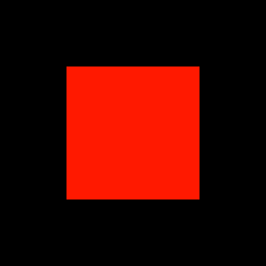
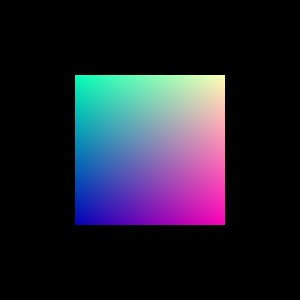

# WebGL

In this lesson you'll learn the basic structure of an HTML 5 3D
graphics program, i.e., a WebGL program.  The JavaScript portion
of the WebGL program will follow the pattern of the examples at
the end of the previous lesson.

## Background

An image on the screen is composed of *pixels*, each a single
color.  In order to determine what color each pixel should be,
geometric elements of a 3D scene are *rasterized*---they are
broken up into single-color *fragments*, each corresponding to a
pixel.  In general, you want each fragment to be processed in the
same way, and that processing can be done in parallel because the
fragments are independent of each other.  So there is a part of a
WebGL program, called a *fragment shader*, where you put the code
that can be run in parallel for each fragment.

What are the geometric elements of a 3D scene referred to in the
previous paragraph---the things that are rasterized into
fragments?  Points, lines and triangles.  The location of a point
is specified by a single *vertex*.  The location of a line is
specified by two vertices; the location of a triangle by three.
In general, you want each vertex to be processed in the same way,
and that processing can be done in parallel because the vertices
are independent of each other.  Sound familiar?  Just as there is
a part of a WebGL program for parallel processing of fragments
(the fragment shader), there is a part of a WebGL program for
parallel processing of vertices, called a *vertex shader*.

Why are these parts of the program called *shaders*?  In earlier
versions of the OpenGL standard, there were built-in functions for
typical operations used to specify vertex locations and fragment
colors.  Additional per-vertex and per-fragment operations, often
used to create custom shading effects, were programmed in vertex
and fragment shaders, which were optional at that time.  Since
OpenGL version 3.0 the built-in functions for specifying vertex
locations and fragment colors have been deprecated.  The WebGL
standard (which is based on OpenGL) does not include
these functions at all.  So today vertex and fragment
*shaders* aren't just used for custom shading effects, they're a
part of any non-trivial WebGL (or OpenGL)  program.  Whatever can
be done in parallel for each vertex goes in a vertex shader;
whatever can be done in parallel for each fragment goes in a
fragment shader.

Where do you put the *main* for your program, the part that
isn't meant to be parallelized?  It's written in JavaScript, run
from within a web page written in HTML.  Much of the challenge in
WebGL programming is in getting data from the JavaScript part of
the program to the vertex and fragment shaders.  It will probably
seem unecessarily complex at first, but it should make more sense
as you get used to the idea that many instances of the shader code
will run in parallel.  All of the input data needs to be set up
ahead of time and copied to a place where the shader code will
have access to it; then the JavaScript program says "go" and
everything happens at once.  We'll walk through this in detail
with examples, starting from a trivial program that does not
include shaders.

## A Cleared Canvas [^1]

Your first WebGL program, meant to show how the HTML, CSS and
JavaScript parts fit together, draws a solid black square.
Here's the HTML:

~~~html
<!DOCTYPE html>
<html>
    <head>
        <meta charset="UTF-8">
        <link rel="stylesheet" href="style.css" />
        
    </head>
    <body>
        

            <canvas id="canvas" width="300" height="300"></canvas>
        

    </body>
</html>
~~~

In the `head` section, the following two lines connect the HTML
file to a CSS file called "style.css" and a JavaScript file
called "square.js".  These will be described in detail below.

~~~html
<link rel="stylesheet" href="style.css" />

~~~

One thing might seem strange if you have past experience with HTML:

~~~html

    <canvas id="canvas" width="300" height="300"></canvas>

~~~

Although there is an external stylesheet file (style.css), the
`width` of the `div` is specified inline.  And the `width` and
`height` for the `canvas` are specified in the tag as individual
properties rather than as styles.  The reason `height` and `width`
are set as individual properties is that it improves the result
when the 3D scene is rendered and displayed on the page.  In order
for the styles specified in the CSS file (described below) to
work properly, the `width` of the `content` `div` needs to match
the `width` of the `canvas`.  So the `width` of the `content`
`div` is set inline, so that if later you want to change the
`width` of the `canvas`, you won't have to go to the CSS file to
change the `width` of the `div` to make them match.

Here's the CSS file, style.css:

~~~css
@charset "UTF-8";

#content {
    margin: auto;
    margin-top: 40px;
}
~~~

The `div` element of the HTML file, with the id `content`, is used
here to center the canvas horizontally---`margin` is set to
`auto`.  `margin-top` is set to leave a little space between the
top of the page and the canvas.  As with the HTML file, `charset`
is set to UTF-8.

Here's the JavaScript file, square.js:

~~~javascript
/*global document */

(function (global) {
    "use strict";

    global.onload = function () {
        var canvas, gl;

        canvas = document.getElementById("canvas");
        gl = canvas.getContext("experimental-webgl");

        gl.clearColor(0.0, 0.0, 0.0, 1.0);
        gl.clear(gl.COLOR_BUFFER_BIT);
    };

}(this));
~~~

The function assigned to `onload` will run when the browser has
finished loading the page's HTML and CSS files.  The two
assignment statements,
some version of which will be present in every WebGL program, get
a reference to the WebGL context object associated with the
`canvas` element in the HTML file and assign it to `gl`.  The
next two lines...

~~~javascript
gl.clearColor(0.0, 0.0, 0.0, 1.0);
gl.clear(gl.COLOR_BUFFER_BIT);
~~~

...clear the canvas.  The first line sets the color to which the
canvas should be cleared.  The first three arguments represent red,
green and blue values; they're all `0.0`, which gives you the
color black.  If they were all `1.0`, you'd get white.  (The
fourth value, called *alpha*, can be used for transparency and
other compositing effects.  An alpha value of `1.0` would
generally be used to indicate a fully opaque color.)  The second
line clears the canvas, specifically the buffer with color values
for each fragment.  There are other buffers, with other
per-fragment values, which can be cleared if you pass other
arguments to the `clear` method.

@.  *Put square.html, square.js and style.css in a folder, run a
    local web server, open square.html in a browser...  Your
    result should look like what you see in Figure 3.1 below.*

<figure style="width:300px">
    
    <!-- <canvas id="canvas_3_1" width=300 height=300></canvas> -->
    <figcaption><strong>Figure 3.1:</strong> A Cleared Canvas</figcaption>
</figure>
<!--  -->

## A Red Square

The second example clears the canvas (to black) and then draws a
red square.  To do this we'll add a vertex shader file, to process
the four vertices of the square, and a fragment shader file, to
color the fragments that make up the square.  The HTML and CSS
files won't need to change, but we'll have to add code to the
JavaScript file to set up the shaders, put vertex data in a place
where the vertex shader will have access to it, and to use the
vertex and fragment shaders to draw the square.

First, the vertex shader, square.vert:

~~~glsl
attribute vec3 position;

void main(void) {
    gl_Position = vec4(position, 1.0);
}
~~~

An `attribute` variable is used to pass per-vertex data from the
JavaScript part of a WebGL program to the vertex shader.  In this
case, the variable is called `position` and its type is `vec3`,
which stores three floating-point values.  A separate instance of
the vertex shader code will run (in parallel) for each vertex;
that is, a bunch of these will run at the same time, each starting
with `position` equal to a different set of x, y, and z
coordinate values.  We'll see below how to get the values from
the JavaScript part of the program to these vertex shader
instances.

The `main` of the vertex shader copies `position` to the special
variable `gl_Position`.  Whatever is assigned to `gl_Position`
will be the position of the vertex.  The type of `gl_Position`,
however, is `vec4`, so `vec4(position, 1.0)` is used to add a
fourth value to `position` before assigning it to `gl_Position`.
What's the significance of this fourth value?  The vertex position
assigned to `gl_Position` needs to be given in *homogeneous
coordinates*.  We'll see why homogeneous coordinates are used
later on this course.  For now, its enough to know that a vertex
position $(x, y, z, w)$ in homogeneous coordinates is equivalent
to the position $(\frac{x}{w}, \frac{y}{w}, \frac{z}{w})$ in
standard coordinates.  So $(x, y, z, 1)$, in homogeneous
coordinates, is equivalent to $(x, y, z)$, in standard coordinates.

Next, the fragment shader, square.frag:

~~~glsl
void main(void) {
    gl_FragColor = vec4(1.0, 0.1, 0.0, 1.0);
}
~~~

Unlike the vertex shader above, this fragment shader doesn't get
any data from the JavaScript part of the WebGL program.  (We'll
see how to do that later.)  It simply assigns a
four-float vector to the special variable `gl_FragColor`.  Just
as whatever is assigned to `gl_Position` in a vertex shader will
be the vertex's position, whatever is assigned to `gl_FragColor`
in a fragment shader will be the fragment's color.  The four
values are for red, blue, green and alpha (just like when we set
the clear color in the first example).  So the color assigned to
`gl_FragColor` here is (fully opaque) red, with a little bit of
green mixed in.

Now, on to the JavaScript file, square.js.  We've added a lot of
code.  Keep in mind the purpose of the changes:  we need to set up
the shaders, put data in a place where the shaders will have
access to it, and draw the red square.

~~~javascript
/*jslint white: true */
/*global XMLHttpRequest, document, Float32Array */

(function (global) {
    "use strict";

    var readFile, gl, onVertexShaderLoad, vertexShader,
            onFragmentShaderLoad, fragmentShader, main;

    readFile = function (path, callback) {
        var r = new XMLHttpRequest();

        r.onreadystatechange = function () {
            if (r.readyState === 4 && r.status === 200) {
                callback(r.responseText);
            }
        };

        r.open("GET", path, true);
        r.send();
    };

    global.onload = function () {
        gl = document.getElementById("canvas").getContext(
                "experimental-webgl");

        // Request vertex shader source.
        readFile("square.vert", onVertexShaderLoad);
    };

    onVertexShaderLoad = function (shaderSource) {

        // Once vertex shader source is loaded, create vertex
        // shader object for it; compile it.
        vertexShader = gl.createShader(gl.VERTEX_SHADER);
        gl.shaderSource(vertexShader, shaderSource);
        gl.compileShader(vertexShader);

        // Request fragment shader source.
        readFile("square.frag", onFragmentShaderLoad);
    };

    onFragmentShaderLoad = function (shaderSource) {

        // Once fragment shader source is loaded...
        fragmentShader = gl.createShader(gl.FRAGMENT_SHADER);
        gl.shaderSource(fragmentShader, shaderSource);
        gl.compileShader(fragmentShader);

        // Continue with the rest of the program.
        main();
    };

    main = function () {
        var shaderProgram, vertexData, vertexBuffer,
                vertexPositionAttribute;

        gl.clearColor(0.0, 0.0, 0.0, 1.0);
        gl.clear(gl.COLOR_BUFFER_BIT);

        // Set up shader program (based on compiled vertex
        // and fragment shaders).
        shaderProgram = gl.createProgram();
        gl.attachShader(shaderProgram, vertexShader);
        gl.attachShader(shaderProgram, fragmentShader);
        gl.linkProgram(shaderProgram);
        gl.useProgram(shaderProgram);

        // Put vertex data (coordinates for the four corners of a
        // square) in a buffer where the vertex shader will have
        // access to it.
        vertexData = [
                -0.5,  0.5,  0.0,    // x = -0.5, y = 0.5, z = 0.0
                 0.5,  0.5,  0.0,
                -0.5, -0.5,  0.0,
                 0.5, -0.5,  0.0 ];
        vertexBuffer = gl.createBuffer();
        gl.bindBuffer(gl.ARRAY_BUFFER, vertexBuffer);
        gl.bufferData(gl.ARRAY_BUFFER, new Float32Array(vertexData),
                gl.STATIC_DRAW);

        // Set things up so that it will be possible to copy data
        // from a buffer to the vertex shader variable "position."
        vertexPositionAttribute = gl.getAttribLocation(shaderProgram,
                "position");
        gl.enableVertexAttribArray(vertexPositionAttribute);

        // Clear the canvas.
        gl.clearColor(0.0, 0.0, 0.0, 1.0);
        gl.clear(gl.COLOR_BUFFER_BIT);

        // Specify which buffer vertex data will come from, and how
        // that data should be interpreted; then draw the square.
        gl.bindBuffer(gl.ARRAY_BUFFER, vertexBuffer);
        gl.vertexAttribPointer(vertexPositionAttribute, 3, gl.FLOAT,
                false, 12, 0);
        gl.drawArrays(gl.TRIANGLE_STRIP, 0, 4);
    };
}(this));

~~~

The `readFile` function is used to read text from a file
accessible via a URL.  The function assigned to `onload` calls
`readFile` to get the vertex shader source code, specifying that
`onVertexShaderLoad` should be called when the vertex shader
source is available.  `onVertexShaderLoad` creates `vertexShader`,
through which the shader source code can be compiled and (later
on in `main`) made part of the shader program used to generate
the image.  After this `onVertexShaderLoad` calls `readFile` to
get the fragment shader source code.
Once the fragment shader source is available,
`onFragmentShaderLoad` will be called to compile the fragment
shader source.  After this `onFragmentShaderLoad` will call `main`
to run the rest of the program.

In main, after setting up the shader program from the vertex
and fragment shader source code, the coordinates of a square's
four vertices are put into a JavaScript Array object:

~~~javascript
vertexData = [
        -0.5,  0.5,  0.0,    // x = -0.5, y = 0.5, z = 0.0
         0.5,  0.5,  0.0,
        -0.5, -0.5,  0.0,
         0.5, -0.5,  0.0 ];
~~~

To understand these numbers, you need to know something about the
coordinate system of the 3D scene generated by WebGL and displayed
when the HTML file's `canvas` element is rendered by the browser
and displayed on the page.  Like the OpenGL API it's based on,
WebGL clips the 3D scene so that it extends from $-1$ to $1$ in
the $x$, $y$ and $z$ directions.  The bottom left front corner is
$(-1, -1, -1)$; the top right back corner is $(1, 1, 1)$.  This is
true regardless of the size or aspect ratio of the `canvas`
element set in the HTML and CSS files.  So the vertex coordinates
given above specify a square on the $z = 0$ plane, extending
halfway from the center to the outside edge of the scene in the
$x$ and $y$ directions.

The next three statements put this data in a place where the
vertex shader will have access to it.

~~~javascript
vertexBuffer = gl.createBuffer();
gl.bindBuffer(gl.ARRAY_BUFFER, vertexBuffer);
gl.bufferData(gl.ARRAY_BUFFER, new Float32Array(vertexData),
        gl.STATIC_DRAW);
~~~

The first statement creates a WebGL buffer, the second tells WebGL
that this newly created buffer is the one we want to work with,
and the third statement copies the data from `vertexData` to the
new WebGL buffer.  The constructor `Float32Array` is used to
convert the data from a JavaScript Array object to a true array;
`gl.STATIC_DRAW` is to indicate that the data in the buffer
won't change.  WebGL may be able to use this information to
improve the performance of the program.

Next, we tell WebGL that the vertex shader's `position` variable
is a possible destination for per-vertex data coming from a
buffer.

~~~javascript
vertexPositionAttribute = gl.getAttribLocation(shaderProgram,
        "position");
gl.enableVertexAttribArray(vertexPositionAttribute);
~~~

Then, after clearing the canvas, we draw the square:

~~~javascript
gl.bindBuffer(gl.ARRAY_BUFFER, vertexBuffer);
gl.vertexAttribPointer(vertexPositionAttribute, 3, gl.FLOAT,
        false, 12, 0);
gl.drawArrays(gl.TRIANGLE_STRIP, 0, 4);
~~~

The first statement (which we've seen before) tells WebGL that
`vertexBuffer` is the buffer we want to work with.  The second
tells how the data from the buffer should be interpreted:
it should go to the vertex shader's `position` variable
(referred to via `vertexPositionAttribute`), there are three
values per vertex, they are float values, there are 12 bytes
between the beginning one vertex's data and the next vertex's
data (since each value is a 32-bit float), and the first value
is at the first byte of the buffer.  (`false` indicates that
nonfloating data should not be normalized---we're sending float
values, so this is irrelevant.)

The third statement is where we actually draw the square.
`gl.TRIANGLE_STRIP` means we'll draw a strip of connected
triangles: the first three vertices form the first triangle;
the second, third and fourth form the second triangle.  (If there
were more vertices the third, fourth and fifth would form the
next triangle, the fourth, fifth and sixth would form the next,
etc.)

@.  *Put the five files from this example in a folder, open
    square.html in a web browser...  Figure 3.2 shows what I expect
    you to see.*

<figure style="width:300px">
    
    <!-- <canvas id="canvas_3_2" width=300 height=300></canvas> -->
    <figcaption><strong>Figure 3.2:</strong> A Red Square</figcaption>
</figure>
<!--  -->

@.  *Modify this example so that the canvas size on the page is
    400x300.  Notice that the square is no longer square.  (It's
    rectangular.)  Change the values of `vertexData` so that it
    becomes square again (and is still centered in the canvas).*

@.  *Modify this example so that it uses the `readFiles` function
    you wrote for the second JavaScript lesson to load the two
    shader files concurrently.*

## A More Colorful Square

This example introduces two new types of shader variables (in
addition to `attribute` variables, introduced in the previous
example):  `uniform` variables, which are used to pass, from the
JavaScript part of the program to the shaders, values that are the
same for all vertices and fragments, and `varying` variables,
which are used to pass data from a vertex shader to a fragment
shader.  You'll see below why the word `varying` is used to
describe them.

The HTML and CSS files stay the same.  Here's the vertex shader,
square.vert:

~~~glsl
attribute vec3 position;
uniform float blueValue;
varying vec3 color;

void main(void) {
    gl_Position = vec4(position, 1.0);
    color = vec3(position.x + 0.5, position.y + 0.5, blueValue);
}
~~~

There are two new global variables in the vertex shader,
`blueValue` and `color`.  `blueValue` is a `uniform` variable.
It gets its value from the JavaScript part of the program, and
its value is the same for all vertices.  `uniform` variables can
also be used to pass values from the JavaScript part of the
program directly to a fragment shader.  In that case the value
of the `uniform` is the same for all fragments.

`color` is a `varying` variable.  This means it will be assigned
a per-vertex value in the vertex shader.  It will have a
*per-fragment* value in the fragment shader, however.  The value
a fragment gets will be interpolated; for example, if a fragment
is positioned halfway between a vertex for which the `varying`
variable is assigned `0.0` and a vertex for which the `varying`
variable is assigned `1.0`, the fragment will get `0.5`.

One more thing to notice about the vertex shader:  the OpenGL
Shading Language (GLSL), the language vertex and fragment shaders
are written in, allows you to access the elements of a `vec3`
variable using `.x` or `.y`.  This is called *swizzling* and is an
interesting example of how a special purpose programming language
can include very specific data types and features to make programs
more readable.  You can use `.z` to access the third value.  In
fact, you can also use `.r`, `.g` and `.b` as an alternative to
`.x`, `.y` and `.z`, since `vec3` variables are often used to store
colors.

Here's the line that assigns a value to the `varying` variable
`color` in the vertex shader:

~~~glsl
color = vec3(position.x + 0.5, position.y + 0.5, blueValue);
~~~

`color` needs three values:  red, green and blue.  The red value
here is based on the $x$ coordinate of the vertex.  The coordinate
value is in the range `-0.5` to `0.5`, but the red value should
be in the range `0.0` to `1.0`, so we add `0.5`.  Likewise with
the green value.  The blue value is `blueValue`, which will be
set in the JavaScript part of the program.

Here's the fragment shader, square.frag:

~~~glsl
varying lowp vec3 color;

void main(void) {
    gl_FragColor = vec4(color, 1.0);
}
~~~

Notice that here `color` is declared with the precision qualifier
`lowp`.  Many fragment shader instances will run in parallel, and
they'll each have their own copy of all per-fragment variables (like
`color`).  So it's important to minimize the amount of memory
required.  Because of this the precision of fragment shader
variables must be specified.  `lowp`, for low precision, is
guaranteed to provide enough precision for color values, and should
be used whenever possible.  (Higher-precision alternatives are
`mediump` and `highp`.)

You need to add the two statements below to square.js, just before
clearing the `canvas` and drawing the square.  (You'll also need
to declare the variable `blueValueUniform` at the beginning of
`main`.)  These statements set the
value of the vertex shader's `uniform` variable `blueValue` to a
random number between `0.0` and `1.0`.

~~~javascript
blueValueUniform = gl.getUniformLocation(shaderProgram,
        "blueValue");
gl.uniform1f(blueValueUniform, Math.random());
~~~

With these changes, you get the image in Figure 3.3
(depending on the random value assigned to `blueValue`).

<figure style="width:300px">
    <!--  -->
    <canvas id="canvas_3_3" width=300 height=300></canvas>
    <figcaption><strong>Figure 3.3:</strong> A More Colorful Square</figcaption>
</figure>

@.  *`gl.TRIANGLE_FAN` is an alternative to `gl.TRIANGLE_STRIP`.
    With `gl.TRIANGLE_FAN`, all triangles share the first vertex
    specified:  the first three vertices form the first triangle,
    the first, third and fourth form the second triangle, the
    first, fourth and fifth form the third, and so on.  Using
    `gl.TRIANGLE_FAN`, modify the second example ("A Red Square")
    so that it draws a yellow octagon.  Make the center of the
    octagon the first vertex.)*

@.  *After doing the previous exercise, modify the third example
    ("A More Colorful Square") so that
    it draws an octagon with a yellow center, fading to orange
    at the outside.*

[^1]: Based on an example from chapter 2 of the *WebGL Programming Guide*, by Kouichi Matsuda and Roger Lea. 
